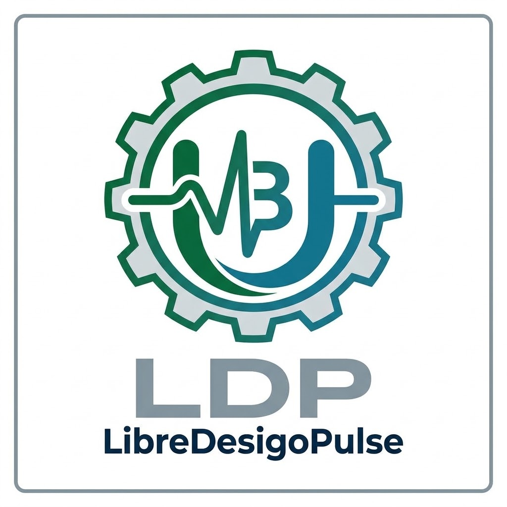
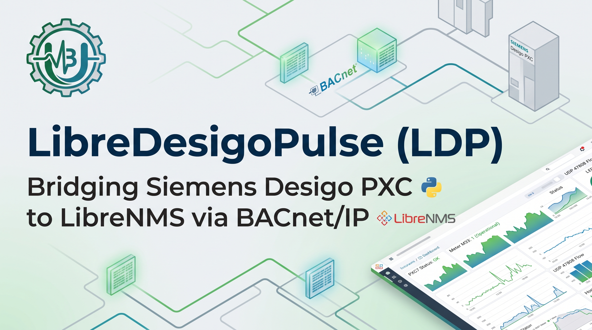
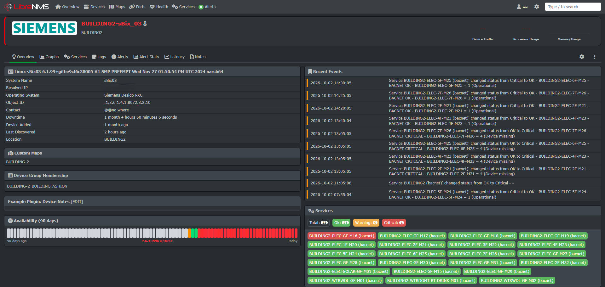
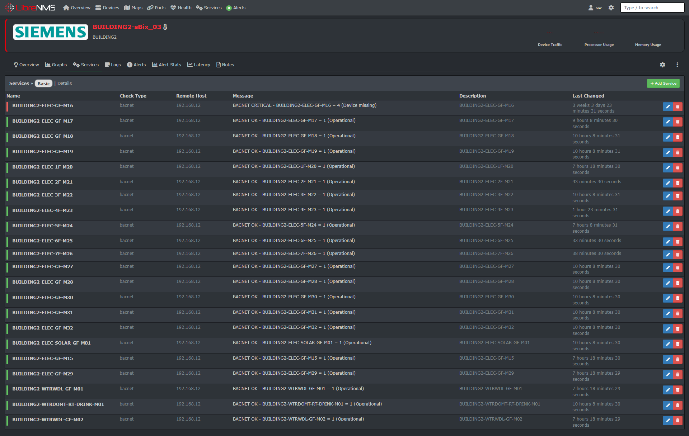
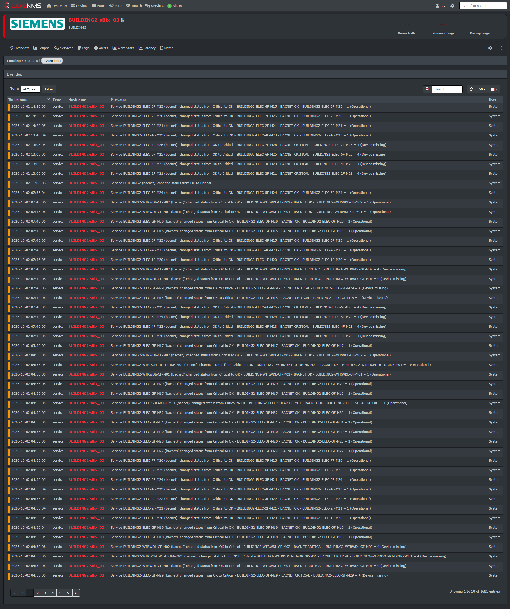

<div align="center">



# LibreDesigoPulse (LDP)

### Meters → Modbus → Controllers → BACnet → LibreNMS

[](https://www.python.org/)
[](LICENSE)
[](#9-contributing--community)

</div>



> Bridges field meters behind controllers like **Siemens Desigo PXC5/PXC7** to **LibreNMS** over **BACnet/IP**.
> Includes custom OS detection, auto-discovery, and service checks.
> Pure Python 3 stdlib — no pip dependencies.

---

## 1. Problem & Why BACnet

Your power / water / steam meters speak **Modbus RTU (serial)** to a Siemens PXC station. The meters have **no IP of their own**. You want them in LibreNMS with green/red states and history graphs like this:

`BACNET OK - BUILDING3-ELEC-1F-M33 = 1 (Operational)`

Why this project exists:

- **SNMP is a dead end on PXC firmware.** A full walk proves the agent serves only the MIB-II `system` group — no interfaces, no CPU/memory, no traps, no enterprise OIDs. SNMP is only good for basic up/down status.
- **Modbus TCP is not offered.** Port 502 is refused. The PXC is a Modbus *master* — it polls the meters over its COM ports, and each meter's state lives as a BACnet object on the owning station.
- **BACnet/IP works.** Unicast `ReadProperty` to UDP 47808 works across subnets with no BBMD required. There is no need for the certificate-secured BACnet/SC (`wss://`) hub the ABT server uses.

Reference: [Siemens Desigo PXC5.E24 documentation (SID)](https://sid.siemens.com/r/A6V14075210/20928157067_32211960459__en-US_20928529291)

---

## 2. How It Works

```text
[ Modbus meters ] --serial COM--> [ Siemens PXC5.E24 / PXC7 ] --BACnet/IP UDP 47808--> [ LibreNMS server ]
      M33, M34, ...                  sBix_01..sBix_04, inst 1-4                        check_bacnet services
                                          |                                                 |
                              Multistate 'PrphDev' objects                         Services + graphs + alerts
                              1 = Operational, 4 = Device missing
```

Each meter appears on its station as a BACnet `multi-state-value` named e.g. `BUILDING3'sBix_04'BUILDING3-ELEC-1F-M33'PrphDev`. This project reads `present-value` + `state-text` and turns it into a LibreNMS service check.

Station health objects (`ModbusSta`, `PltSta`, `AsSta`, `IOBusSta`) provide early warning indicators before individual meters drop offline.

### Verified Hardware & Sites

| Device | Model | BACnet Instance | Answers BACnet/IP? | Status |
| --- | --- | --- | --- | --- |
| sBix_01 | PXC7.E400L | 1 | Yes | Production |
| sBix_02 | PXC5.E24 | 2 | Pending | SC hub role / halted program |
| sBix_03 | PXC5.E24 | 3 | Yes | Production |
| sBix_04 | PXC5.E24 | 4 | Yes | Production |

Meter state numbering (confirmed live): **1 = Operational**, 4 = Device missing, plus 8 additional states — descriptive text is served directly by the controller.

---

## Screenshots in Production

### 1. Station Overview & Health

Custom OS detection identifies the **Siemens Desigo PXC** platform, while real-time service badges track downstream Modbus meter states:



### 2. BACnet Services Table

Every peripheral meter reports directly into LibreNMS with native state translation (`1 = Operational`, `4 = Device missing`):



### 3. Transition & Alert History

Full audit trail tracking when field meters drop offline or recover after wiring/maintenance fixes:



---

## 3. What's in This Repo

```text
check_bacnet                                        Nagios-style plugin executed by LibreNMS (BACnet/IP unicast ReadProperty)
bacnet_discover                                     Inventory a station: walks object-list, lists multistate values + states
bacnet2librenms                                     Scan + auto-create LibreNMS services via API (idempotent)
resources/definitions/os_detection/desigo-pxc.yaml  LibreNMS custom OS detection definition
resources/definitions/os_discovery/desigo-pxc.yaml  LibreNMS model/serial/version discovery + state sensors
mibs/siemens/                                       SIEMENS-SMI, AUTOMATION-SMI, AUTOMATION-TC, AUTOMATION-SYSTEM-MIB
assets/banner.jpg                                   Social banner image
assets/logo.jpg                                     Square project logo
assets/librenms-overview.png                        Production overview dashboard screenshot
assets/librenms-services.png                        Services status table screenshot
assets/librenms-eventlog.png                        State transition event log screenshot
```

All three scripts must live together in the same directory — `bacnet_discover` and `bacnet2librenms` import `check_bacnet`. Pure Python 3 standard library only.

---

## 4. Requirements

* LibreNMS server with target controller devices already added via SNMP

* Network access via **UDP 47808** from LibreNMS poller to each PXC station

* LibreNMS API token (**Web UI → Settings gear → API → API Settings**)

* On the LibreNMS server: `root` for installation, `librenms` system user for service checks

* BAS engineering access to confirm BACnet/IP is enabled and verify device instance numbers

---

## 5. Installation

### Part A — Custom OS Detection (One-Time Setup)

Without this, PXC7 reports a generic net-snmp `sysObjectID .1.3.6.1.4.1.8072.3.2.10`, causing LibreNMS to display the OS as generic "Linux".

1. **Verify the Automation MIB** from the LibreNMS server:

```bash
snmpwalk -v2c -c <community> <target-ip> .1.3.6.1.4.1.4329
```

If empty, enable SNMP "extended / Automation MIB" in ABT Site → Device Settings → SNMP and re-test. The OS package includes fallback detection if extended MIBs cannot be enabled.

2. **Deploy definitions and MIBs** (adjust `/opt/librenms` path if needed):

```bash
scp resources/definitions/os_detection/desigo-pxc.yaml root@<librenms-ip>:/opt/librenms/resources/definitions/os_detection/
scp resources/definitions/os_discovery/desigo-pxc.yaml root@<librenms-ip>:/opt/librenms/resources/definitions/os_discovery/
scp mibs/siemens/* root@<librenms-ip>:/opt/librenms/mibs/siemens/

ssh root@<librenms-ip> "chown -R librenms:librenms \
  /opt/librenms/resources/definitions/os_detection/desigo-pxc.yaml \
  /opt/librenms/resources/definitions/os_discovery/desigo-pxc.yaml \
  /opt/librenms/mibs/siemens/"
```

(For older LibreNMS directory structures, place YAMLs under `includes/definitions/desigo-pxc.yaml` and `includes/definitions/discovery/desigo-pxc.yaml`).

3. **Clear discovery cache and rediscover:**

```bash
su - librenms
lnms config:clear
lnms device:discover <target-ip>
```

4. **Verify in LibreNMS:** The device overview should show OS as **Siemens Desigo PXC**, hardware model, and firmware version. Health sensors will populate under the **State** tab.

### Part B — BACnet Service Plugins

1. Copy the plugin scripts into your Nagios plugins directory:

```bash
sudo cp check_bacnet bacnet_discover bacnet2librenms /usr/lib/nagios/plugins/
sudo chmod 755 /usr/lib/nagios/plugins/check_bacnet /usr/lib/nagios/plugins/bacnet_discover /usr/lib/nagios/plugins/bacnet2librenms
```

2. Enable service monitoring in LibreNMS:

```bash
su - librenms
lnms config:set show_services true
lnms config:set discover_services true
lnms config:set nagios_plugins /usr/lib/nagios/plugins
```

3. Ensure cron-based polling is active (skip if running the systemd dispatcher):

```bash
echo '*/5 * * * * librenms /opt/librenms/services-wrapper.py 1' | sudo tee /etc/cron.d/librenms-services
```

4. Test execution as the `librenms` user:

```bash
sudo -u librenms /usr/lib/nagios/plugins/check_bacnet -H <target-ip> -i <instance-number>
# Output: BACNET OK - operational [sBix_01 PXC7.E400L 02.22.233.20] | status=0;;;0;5
```

---

## 6. Usage

### a) `check_bacnet` — Core Polling Plugin

Check overall controller health (`system-status = operational`):

```bash
./check_bacnet -H 192.168.1.11 -i 1
```

Monitor Modbus peripheral meter status:

```bash
./check_bacnet -H 192.168.1.14 -i 4 -o msv:33 -l BUILDING3-ELEC-1F-M33 --state-text --ok-states 1
# BACNET OK - BUILDING3-ELEC-1F-M33 = 1 (Operational) | 'BUILDING3-ELEC-1F-M33'=1;;;
```

Monitor analog points (kWh, flow rates, temperature) with warning/critical thresholds and performance graphing:

```bash
./check_bacnet -H <ip> -i <instance> -o av:<n> -u kWh -l 5F_DB2_kWh -w 10000 -c 20000
```

*Common Flags:*

* `-o type:instance`: Target object (`ai`, `ao`, `av`, `bi`, `bo`, `bv`, `msi`, `mso`, `msv`, `device`)

* `-r property`: Property ID (defaults to `present-value`; e.g., `reliability`)

* `-w` / `-c`: Warning / Critical thresholds (`value` or `min:max`)

* `--state-text`: Query and output the controller's human-readable state string

* `--ok-states`: Comma-separated list of healthy numeric states (overrides `-w`/`-c`)

* `-u`: Unit label for graphing perfdata

### b) `bacnet_discover` — Station Inventory Tool

Inspect all objects configured on a station and extract ready-to-use LibreNMS parameters:

```bash
./bacnet_discover -H 192.168.1.13 -i 3
./bacnet_discover -H 192.168.1.13 -i 3 --types msv,av,ai --filter consumption
```

### c) `bacnet2librenms` — Bulk Provisioning via API

Automatically discover and register services in LibreNMS via API (safe and idempotent):

```bash
export LIBRENMS_TOKEN="<your_api_token>"
./bacnet2librenms -H 192.168.1.13 -i 3 --include-health          # Dry run preview
./bacnet2librenms -H 192.168.1.13 -i 3 --include-health --apply  # Commit changes to LibreNMS
```

---

## 7. Alerting

Configure a service alert rule in LibreNMS:

```sql
services.service_status != 0
```

> **Field Tip:** When setting up a new plant, add your services first and allow technicians to correct physical Modbus daisy-chain wiring and addressing before enabling notification dispatchers.

---

## 8. Operations & Troubleshooting

* **Controller Silent on UDP 47808:** If a station does not reply despite BACnet/IP being enabled, check if the station is acting exclusively as a BACnet/SC hub or has an unstarted/halted application program in the ABT Site runtime.

* **Energy / Flow Performance Data:** Discover analog objects with `./bacnet_discover -H <ip> -i <inst> --types av,ai --filter energy`. Adding them as plain services allows LibreNMS to build long-term RRD utilization graphs.

* **OS Recognition Fallback:** If LibreNMS still shows "Linux", run:

```bash
php /opt/librenms/discovery.php -h <target-ip> -d -m core
lnms config:clear
```

---

## 9. Contributing & Community

We are actively expanding LibreDesigoPulse to support more building automation controllers, specialized MIBs, and expanded protocol features. Contributions are very welcome!

### Roadmap / Help Wanted

* [ ] **Expanded Hardware Testing:** Add verification profiles for additional controller series (e.g., Siemens PXC4, PXX, Desigo CC integrations, Schneider Electric, Honeywell, Johnson Controls).
* [ ] **BACnet/SC Support:** Experimental support for secure connect hubs (`wss://`).
* [ ] **Write Capability:** Safe diagnostic overrides for digital points.
* [ ] **LibreNMS Upstream Submission:** Package the YAML OS definitions for direct upstream inclusion in the main LibreNMS repository.
* [ ] **Custom Map to Display Services:** Live plant/floor map dashboard showing meter service states (e.g., LibreNMS availability map / custom widget with per-meter OK / warning / critical tiles).
  * *Option A (built-in, fastest):* LibreNMS availability map — services were created with `name = <meter label>` precisely so each tile maps 1:1 to a meter; group by device (`sBix_01..sBix_04`) for a per-building view.
  * *Option B (custom floor plan):* Small HTML/JS widget over a plant image, polling `GET /api/v0/services/<device>` with the API token and coloring each meter marker by `service_status` (0 OK / 1 warning / 2 critical). Refresh every 60–300 s; link each marker to its service page.

### How to Contribute

1. **Report Tested Hardware:** Add your verified controller model, firmware revision, and object mapping patterns to the Verified Hardware table via a pull request.
2. **Submit PRs:** Keep all core monitoring scripts dependency-free (standard library only) so pollers remain lightweight.
3. **Open Issues:** Share edge cases, unusual BACnet encodings, or vendor-specific multistate value maps.

---

## 10. License

This project is licensed under the [MIT License](LICENSE) — free to use, modify, and integrate into enterprise network operations.

---

